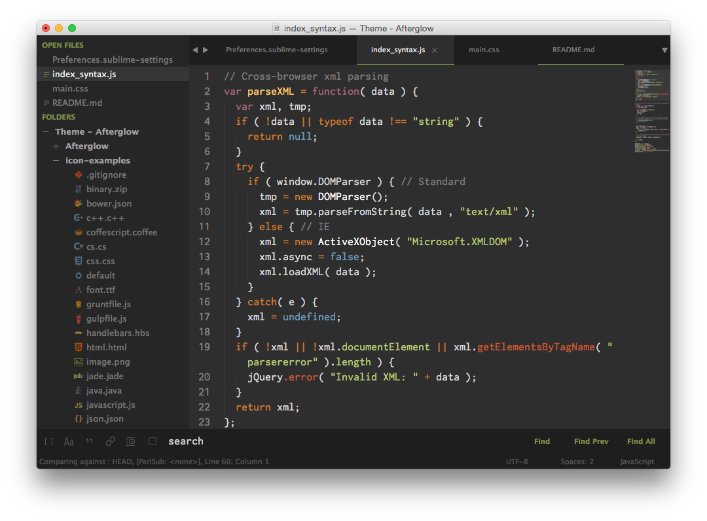
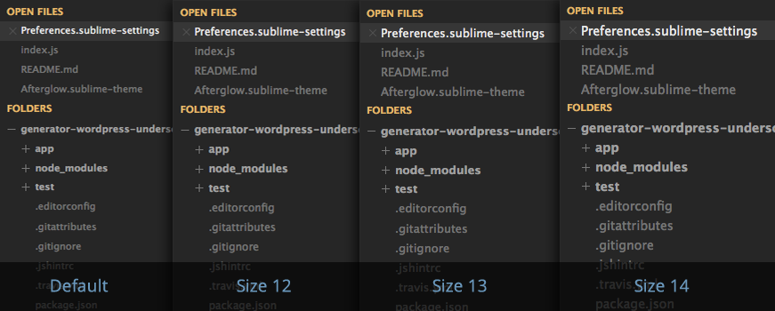
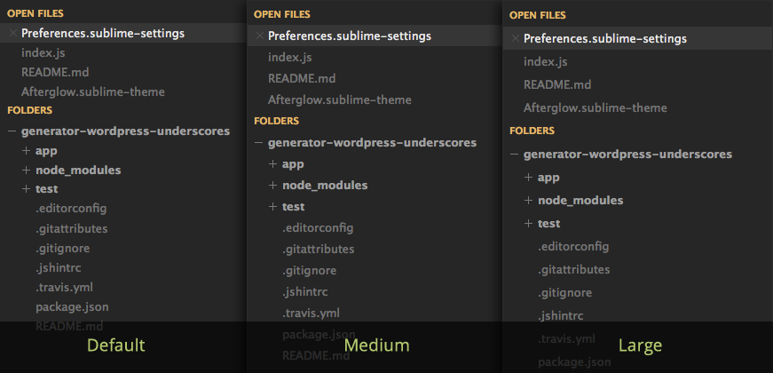
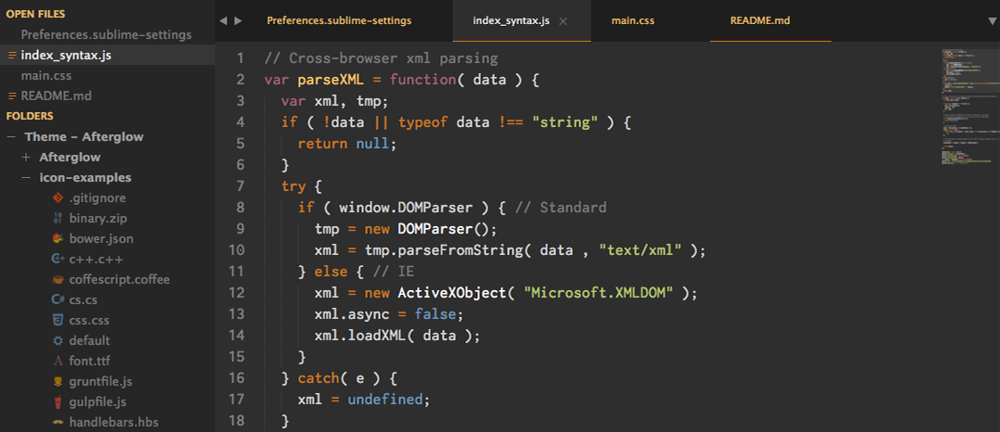
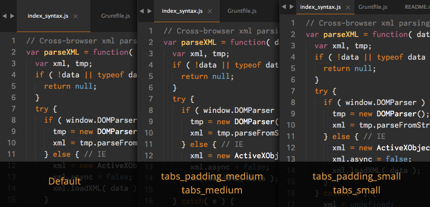
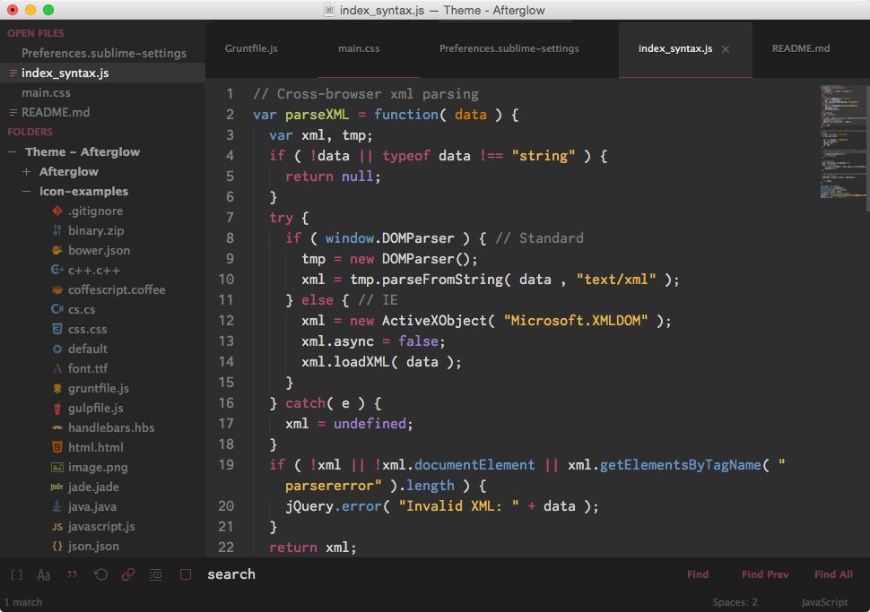

# Afterglow

Afterglow is a minimal dark Theme for Sublime Text 2 and 3. Also it is a syntax color scheme. The theme is based on the great theme [Spacegray](https://github.com/kkga/spacegray). The syntax color scheme is mostly derived from [idlefingers](http://idlefingers.co.uk/).

**Special thanks** to Max Riveiro [@kavu](https://github.com/kavu) for add a lot of icons for sidebar to this repository.

## Design & Colors

#### Afterglow default


[View a larger screenshot](https://raw.githubusercontent.com/YabataDesign/afterglow-theme/master/Screenshots/Afterglow-default.png)

#### Afterglow blue


[View a larger screenshot](https://raw.githubusercontent.com/YabataDesign/afterglow-theme/master/Screenshots/Afterglow-blue.png)

#### Afterglow magenta


[View a larger screenshot](https://raw.githubusercontent.com/YabataDesign/afterglow-theme/master/Screenshots/Afterglow-magenta.png)

#### Afterglow orange


[View a larger screenshot](https://raw.githubusercontent.com/YabataDesign/afterglow-theme/master/Screenshots/Afterglow-orange.png)

#### Afterglow green



[View a larger screenshot](https://raw.githubusercontent.com/YabataDesign/afterglow-theme/master/Screenshots/Afterglow-green.png)

*The font used in the screenshots is [__Inconsolata -g__](http://leonardo-m.livejournal.com/77079.html).*


## Installation

### Package Control

The easiest way to install is using [Sublime Package Control](https://sublime.wbond.net/).

* Open `Command Palette` using menu item `Tools -> Command Palette...`, or `Cmd+Shift+P` (OS X) `Ctrl+Shift+P` (Win/Linux)
* Type `Package Control: Install Package`
* Search `Theme - Afterglow`


### Git Installation

Locate your Sublime Text `Packages directory` by using the menu item `Preferences -> Browse Packages...`.

Then, clone the repository using this command:

    git clone https://github.com/Yabatadesign/afterglow-theme/ "Theme - Afterglow"


### Manual installation

* Download the [GitHub .zip](https://github.com/Yabatadesign/afterglow-theme/archive/master.zip)
* Unzip the files and rename the folder to `Theme - Afterglow`
* Find your `Packages` directory using the menu item  `Preferences -> Browse Packages...`
* Copy the folder into your Sublime Text `Packages` directory.


## Activating the Theme

Activate this theme and color scheme by modifying your user preferences file, which you can find using the menu item `Sublime Text -> Preferences -> Settings - User`.

Then add the following code settings, depending on the theme you choose. **(After activating the theme, you must restart Sublime Text.)**

### Settings for Afterglow

```json
{
    "theme": "Afterglow.sublime-theme",
    "color_scheme": "Packages/Theme - Afterglow/Afterglow.tmTheme"
}
```

### Settings for Afterglow-blue

```json
{
    "theme": "Afterglow-blue.sublime-theme",
    "color_scheme": "Packages/Theme - Afterglow/Afterglow.tmTheme"
}
```

### Settings for Afterglow-magenta

```json
{
    "theme": "Afterglow-magenta.sublime-theme",
    "color_scheme": "Packages/Theme - Afterglow/Afterglow.tmTheme"
}
```

### Settings for Afterglow-orange

```json
{
    "theme": "Afterglow-orange.sublime-theme",
    "color_scheme": "Packages/Theme - Afterglow/Afterglow.tmTheme"
}
```

### Settings for Afterglow-green

```json
{
    "theme": "Afterglow-green.sublime-theme",
    "color_scheme": "Packages/Theme - Afterglow/Afterglow.tmTheme"
}
```


## Configuration

### Sidebar icons

**New:** Now Afterglow theme support sidebar icons.


Don't like the icons? Just add this to your preferences file `Sublime Text -> Preferences -> Settings - User`:

```json
{
    "sidebar_no_icon": true
}
```

Don't like the folde icon? Just add this to your preferences file `Sublime Text -> Preferences -> Settings - User`:

```json
{
    "folder_no_icon": true
}
```


### Tab Height Size Options


You can change the height of the file tabs (medium or small) by adding either to your preferences file `Sublime Text -> Preferences -> Settings - User`:

```json
{
    "tabs_medium": true
}
```

or

```json
{
    "tabs_small": true
}
```


### Sidebar Size Options

You can change the font size of the sidebar and the row padding.


#### Sidebar font size



To **change the font size** (12, 13 or 14; default size is 11), you must add this to your preferences file `Sublime Text -> Preferences -> Settings - User`:

```json
{
    "sidebar_size_12": true
}
```

or

```json
{
    "sidebar_size_13": true
}
```

or

```json
{
    "sidebar_size_14": true
}
```


#### Sidebar row padding size



To **change the row padding** (medium or large), you must add this to your preferences file `Sublime Text -> Preferences -> Settings - User`:

```json
{
    "sidebar_row_padding_medium": true
}
```

or

```json
{
    "sidebar_row_padding_large": true
}
```


### Statusbar font size

To **change the font size** (12, 13 or 14; default size is 11), you must add this to your preferences file `Sublime Text -> Preferences -> Settings - User`:

```json
{
    "statusbar_size_12": true
}
```

or

```json
{
    "statusbar_size_13": true
}
```

or

```json
{
    "statusbar_size_14": true
}
```


### Status bar brighter


If you prefer that the status bar has a brighter color, you have to add this in your user preferences file `Sublime Text -> Preferences -> Settings - User`:

```json
{
    "status_bar_brighter": true
}
```


### Color inactive tabs



You can highlight the color of inactive tabs, adding this to the user preferences file `Sublime Text -> Preferences -> Settings - User`:

```json
{
    "color_inactive_tabs": true
}
```


### Horizontal padding tabs



Through the user preferences file, you can modify the horizontal padding of tabs. It works on all three types of height tabs (default, "tabs_medium" and "tabs_small").

You must add this to your user preferences file `Sublime Text -> Preferences -> Settings - User`:

```json
{
    "tabs_padding_medium": true
}
```

or

```json
{
    "tabs_padding_small": true
}
```

### Non-italic tab labels on Windows


On Windows, tab labels are displayed in *italic* font. If you don't like that, you can add this to the user preferences file `Sublime Text -> Preferences -> Settings - User`:

```json
{
    "tabs_label_not_italic": true
}
```


## Color schemes

### Afterglow - Monokai



Besides color scheme by default, you can use the color scheme `Afterglow - Monokai` based on the original `Monokai`, slightly modified to be consistent with the Theme colors.

You must add this in your user preferences file `Sublime Text -> Preferences -> Settings - User`:

```json
{
    "color_scheme": "Packages/Theme - Afterglow/Afterglow-monokai.tmTheme"
}
```


### Afterglow - Twilight


If you prefer, you can use the color scheme `Afterglow - Twilight` (very slightly modified from the original), adding this to the user preferences file `Sublime Text -> Preferences -> Settings - User`:

```json
{
    "color_scheme": "Packages/Theme - Afterglow/Afterglow-twilight.tmTheme"
}
```


### Markdown


**NEW:** This color scheme support **Github Flavored Markdown**.

#### To enable Afteglow for Markdown

(I highly recommend installing [Sublime Markdown Extending plugin](https://github.com/jonschlinkert/sublime-markdown-extended).)

First, **open a markdown(.md) file**, then navigate to `Sublime Text -> Preferences -> Settings - More -> Syntax Specific - User` in the menu bar.

Add to your current settings or replace with the following:

```json
{
    "color_scheme": "Packages/Theme - Afterglow/Afterglow-markdown.tmTheme",
    "draw_centered": true,
    "draw_indent_guides": false,
    "trim_trailing_white_space_on_save": false,
    "word_wrap": true,
    "wrap_width": 80  // Sets the # of characters per line
}
```


## Dock Icon

You can also download a replacement icon for Sublime Text [here](https://github.com/YabataDesign/sublime-text-icon).


## Retina Resolution UI

Afterglow Theme support retina display.
